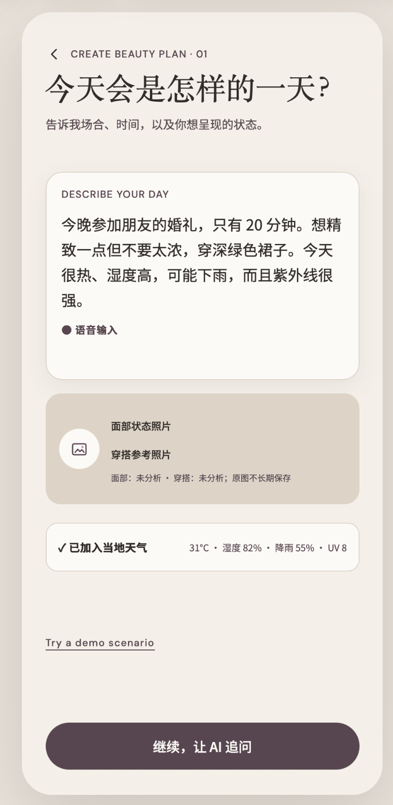
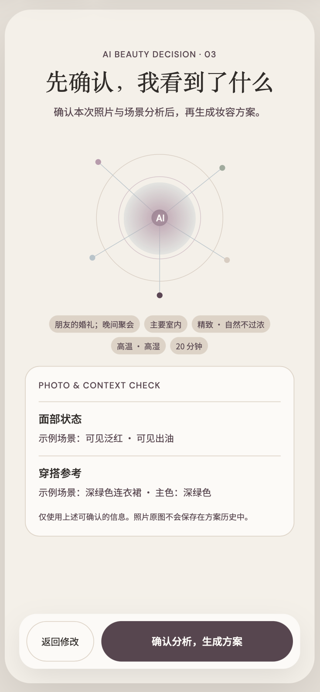
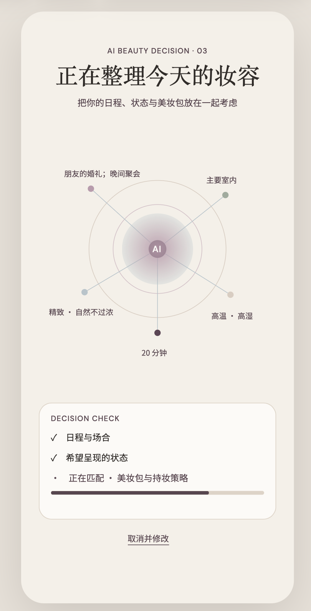
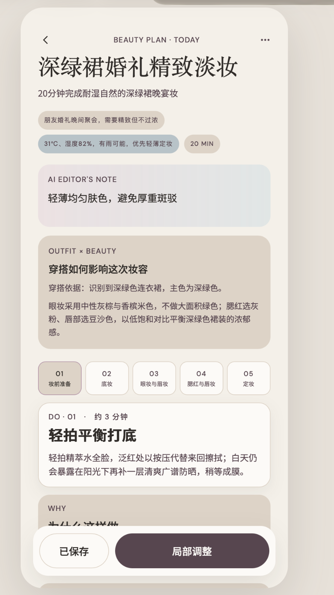
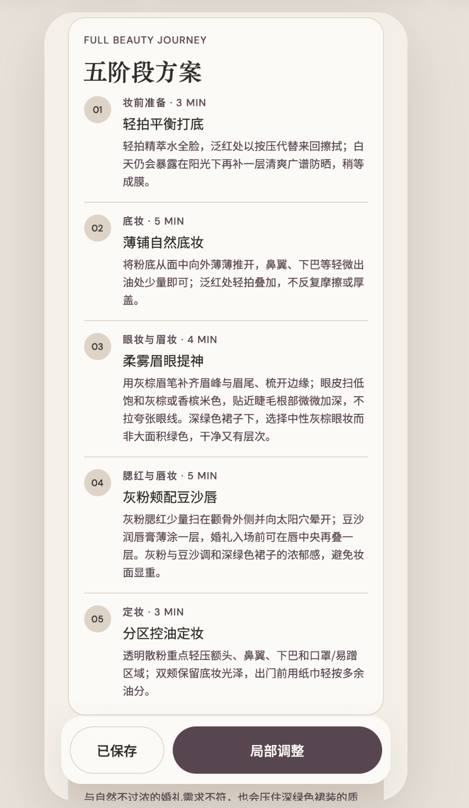

# VANITY／梳妆台

> A mobile-first AI beauty planner for the day ahead.

VANITY 是一款移动端优先的美妆决策 Web App。它结合使用场景、穿搭、天气和已有化妆品，生成可执行的五阶段妆容方案，并支持针对单个步骤继续调整。界面参考 430 × 932 的 Editorial Vanity 移动端设计，产品输出默认为中文。

**项目状态：**可在本机运行的 MVP。代码已公开，应用尚未提供公共在线体验地址。

For English readers: VANITY is a local-first AI beauty planner that turns an occasion, outfit, weather, and existing products into a five-stage makeup plan. It can run in a clearly labeled Demo Mode or use a locally configured OpenAI API key. The interface and generated plans are currently Chinese-first.

## 页面预览

从左到右：场景输入、照片与场景确认、方案生成中。点击图片可查看完整尺寸。

<p align="center">
  <a href="docs/screenshots/01-scene-input.png"></a>
  <a href="docs/screenshots/02-photo-context-check.png"></a>
  <a href="docs/screenshots/03-generating-plan.png"></a>
</p>

方案概览与五阶段步骤：

<p align="center">
  <a href="docs/screenshots/04-beauty-plan.png"></a>
  <a href="docs/screenshots/05-five-step-plan.png"></a>
</p>

## 功能

- 场景文字输入与一次针对关键信息的追问
- 五阶段 Beauty Plan，以及针对单个步骤的局部调整
- 用户主动授权后的天气查询；发送给天气服务前降低坐标精度
- 最长 45 秒的语音输入与受限图片理解
- 商品文字搜索；经 Web Search 与 LLM 整理后返回最多 3 个候选
- 本机保存 Beauty Bag 和最近 5 次 Plan History
- 未配置 AI 时提供明确标注的 Demo Mode；真实输入不会被伪装成 AI 结果

当前的“包装拍照识别”仅保留界面入口，添加商品的可用链路为文字搜索。

## 本地运行

需要 Node.js 22 或更高版本。

```bash
npm install
cp apps/api/.env.example apps/api/.env
npm run dev:all
```

前端默认地址为 `http://127.0.0.1:5173/`，本地 API 默认地址为 `http://127.0.0.1:8787/`。如需启用真实 AI，在 `apps/api/.env` 中填写运行者自己的 `OPENAI_API_KEY`；留空时可使用 Demo Mode。

也可运行 `npm run preview:local`，在 `http://127.0.0.1:4173/` 查看本机构建预览。此命令会先构建前端；代码修改后需重新运行。

```bash
npm run typecheck
npm run test
npm run build
```

## 技术结构

- Web：React、TypeScript、Vite、Tailwind CSS、Zustand、React Router
- API：TypeScript BFF；本机使用 Node HTTP Server，部署时使用 Vercel Function
- AI：OpenAI Responses API、Structured Outputs、Speech-to-Text、Web Search、Vision
- 天气：Open-Meteo
- 本机数据：浏览器 localStorage

项目目录：`apps/web` 为前端，`apps/api` 为 API 实现，`api` 为 Vercel Function 入口，`packages/contracts` 为共享数据类型，`docs` 为开发文档。

## 数据与部署边界

- `apps/api/.env.example` 是不含密钥的配置模板；实际使用的 `apps/api/.env` 已被 Git 忽略。API Key 仅应配置在服务端环境变量中，不应写入前端 `VITE_` 变量、代码或 Issue。
- 定位由用户主动触发，并在请求天气服务前模糊化。原始照片和录音用于当次请求，不写入 Beauty Bag 或 Plan History；后两者保存在使用者自己的浏览器中。
- 仓库包含 Vercel 部署配置，但当前没有公开托管的应用。公共部署若使用部署者的 API Key，访客请求会消耗部署者的额度；面向多人开放前仍需补充访问控制、用量限制和监控。
- AI 输出仅供美妆参考，不提供医学诊断。

## 反馈

欢迎通过 [Issues](https://github.com/crystalxxx301/vanity-ai-beauty-planner/issues) 报告问题或提出产品建议。公开反馈请勿包含个人照片、API Key 或其他敏感信息。如果这个项目有启发，也欢迎 Star。

## 许可

本仓库目前未附带开源许可证。代码可供阅读和评估；复制、修改或再发布前，请先取得许可。
